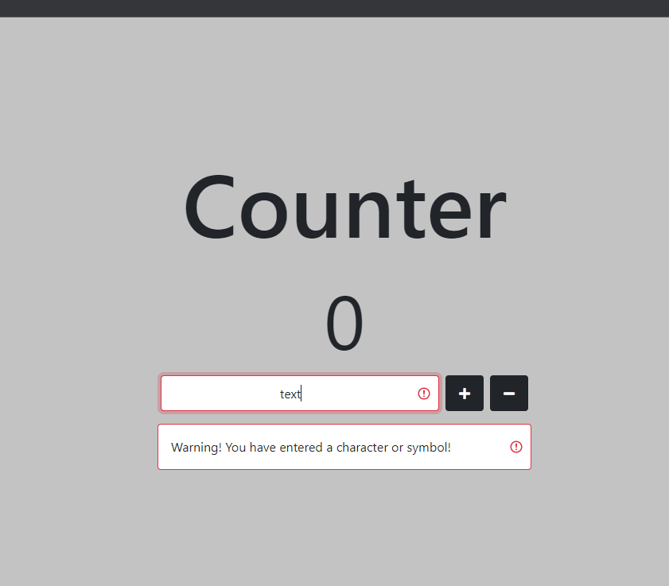
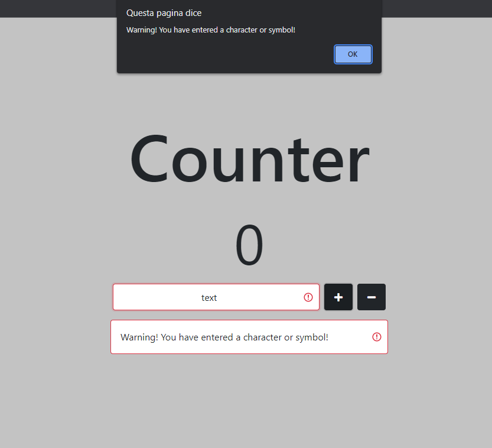
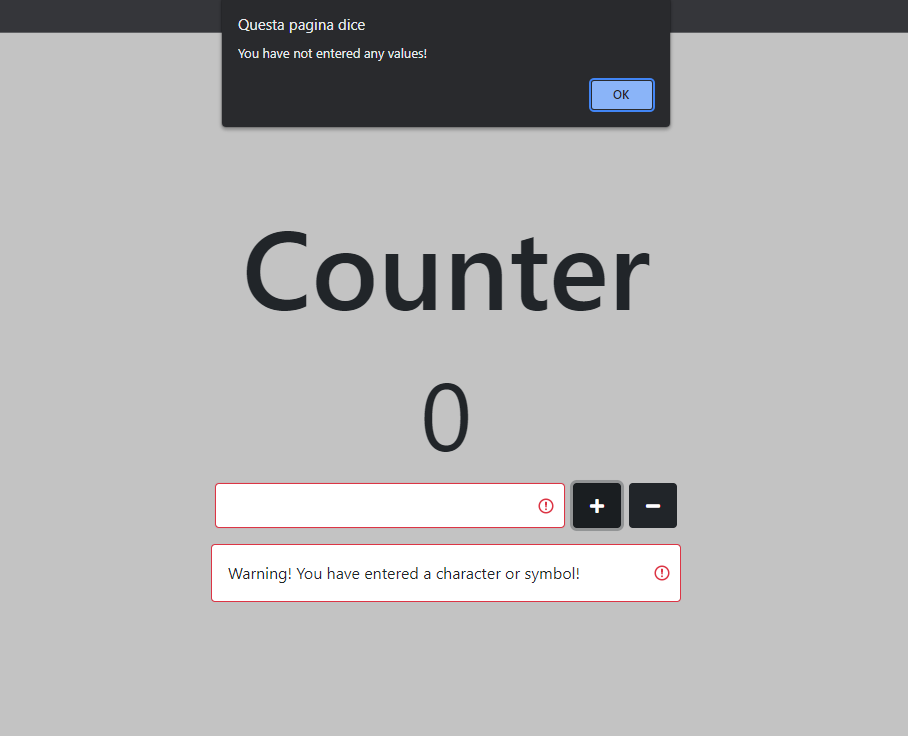

# COUNTER APP

## ABOUT THE PROJECT

The project consists of a simple application that functions as a counter.

(<a href="#top">back to top</a>)

## DESCRIPTION

The application allows the user to increase or decrease the counter by clicking on one of the two available buttons.

(<a href="#top">back to top</a>)

## HOW TO USE THE APPLICATION

By default, the counter will be set to 0 and the value in the text field to 1.

The user can change the number in the text field to any whole number.

Once the desired value has been entered, press the "+" or "-" button to increase/decrease the counter by the amount entered in the text field.

(<a href="#top">back to top</a>)

## POSSIBLE ERRORS

The application will check to see if the input just entered by the user is actually a whole number.

1) If a character or symbol is entered in the text field, the application will display the following error:

2) If the user tries to click the "+" or "-" button, the following popup will be displayed:

3) If no value is entered in the text field and the user tries to click one of the two buttons, the following popup will be displayed:

(<a href="#top">back to top</a>)

## CONTACTS

Email: [gennuso.biagio@gmail.com](mailto:gennuso.biagio@gmail.com)

Github: [Counter App](https://github.com/bilabixxx/Counter-App)

(<a href="#top">back to top</a>)

